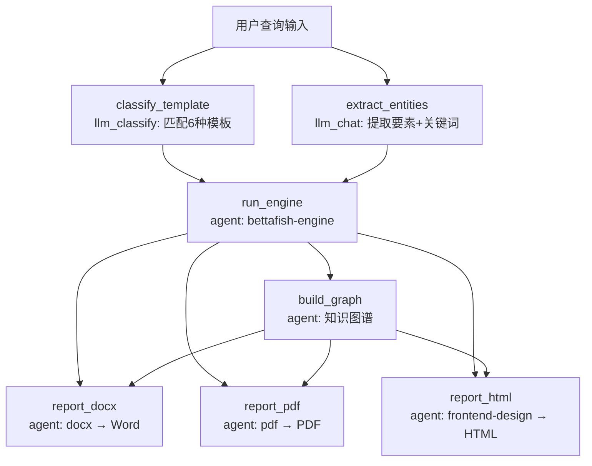

# BettaFish 舆情分析系统（MetaSKILL）

BettaFish（微舆）是一个**无数据库依赖、无模拟数据**的舆情分析系统，运行于 **OpenClaw.net AgentRuntime**。

本 MetaSKILL 编排 **7 步 DAG**：模板分类 → 要素提取 → 三引擎角色扮演分析 → 知识图谱 → 三格式报告并行生成。



> **架构说明**：核心的 QueryAgent + MediaAgent + InsightAgent 三引擎角色扮演、ForumHost 协作讨论、3 轮反思循环封装在 `bettafish-engine` 子 Skill 内部，由 MetaSKILL 作为单一 `agent` 步骤调用。在 OpenClaw 单 Agent 运行时中，三个角色由 Agent 依次扮演。这避免了在 MetaSKILL DAG 中展开循环导致步骤数爆炸。

## 输出产物说明

本 MetaSKILL **同时生成三种格式的报告**，每种格式都包含**丰富的文本内容**：

### 1. Word 文档 (.docx)
- **用途**: 正式汇报、打印存档、邮件附件、向上级提交
- **特点**: 结构清晰、图文并茂、标准公文格式
- **生成方式**: 使用 `docx` subskill 通过 docx-js 生成

### 2. PDF 文档 (.pdf)
- **用途**: 正式汇报、跨平台分享、不可编辑存档
- **特点**: 版式固定、兼容性强、专业外观
- **生成方式**: 使用 `pdf` subskill 通过 reportlab 生成

### 3. HTML 交互式报告 (.html)
- **用途**: 演示展示、在线分享、交互探索
- **特点**: 编辑杂志风格设计、丰富的交互可视化
- **生成方式**: 使用 `frontend-design` subskill 生成

---

## 报告模板系统

本 MetaSKILL 内置 **6 种专业舆情分析报告模板**，由 `classify_template` 步骤智能匹配。

### 模板类型与适用场景

| 模板名称 | classify_template 输出 | 适用场景 | 核心特点 |
|---------|----------------------|---------|---------|
| **企业品牌声誉分析** | `brand_reputation` | 品牌月度/季度声誉监测 | 品牌形象、用户认知、声誉风险 |
| **突发事件与危机公关** | `crisis` | 危机事件应急分析 | 事件溯源、传播分析、应对策略 |
| **社会公共热点事件** | `hotspot` | 社会热点追踪 | 演变脉络、传播路径、多方观点 |
| **市场竞争格局分析** | `competition` | 竞品对比、市场份额 | SOV对比、口碑对比、营销策略 |
| **特定政策/行业动态** | `policy` | 政策解读、行业分析 | 政策影响、行业反应、机遇挑战 |
| **日常/定期舆情监测** | `monitoring` | 周期性监测报告 | 数据看板、趋势追踪、风险预警 |

### 模板匹配示例

| 用户查询 | 自动分类 |
|---------|---------|
| "分析某咖啡连锁品牌社交媒体口碑" | `brand_reputation` |
| "某音乐节安全事故危机分析" | `crisis` |
| "对比可口可乐和百事可乐的舆情表现" | `competition` |
| "追踪环保新规对饮料行业影响" | `policy` |
| "本周我司品牌舆情监测" | `monitoring` |

### 报告内容结构要求

所有报告必须包含以下**8个核心章节**：

```
1. 执行摘要（核心发现 + 关键指标 + 主要结论）
2. 品牌声量与影响力分析（整体趋势 + 渠道分布 + 区域分析）
3. 关键事件深度回顾（时间线 + 多方观点 + 数据支撑）
4. 情感与认知分析（情感光谱 + 品牌联想 + 核心议题）
5. 用户画像分析（人群属性 + 触媒习惯）
6. 声誉风险与机遇洞察（负面议题 + 风险预警 + 正面机遇）
7. 结论与战略建议（SWOT分析 + 优化建议 + 监测重点）
8. 数据附录（指标汇总 + 来源清单）
```

### 内容丰富度标准

**每个章节必须包含**：
- **详细分析段落**：至少3-5段深入分析文字
- **具体数据支撑**：KPI指标、百分比、对比数据
- **多维度视角**：Query/Media/Insight 三引擎交叉分析
- **案例说明**：具体事件、引用、用户评论示例
- **表格展示**：事件时间线、数据对比、来源清单
- **引用块**：关键结论、分析师总结、用户原话

**禁止**：
- ❌ 只有图表没有文字解释
- ❌ 只有数据没有分析洞察
- ❌ 只有标题没有详细内容
- ❌ 使用占位符或模板文本

---

## 设计规范：编辑杂志风格

HTML 报告采用 **Editorial/Magazine（编辑杂志）风格**：

| 设计元素 | 规范 | 说明 |
|---------|------|------|
| **整体风格** | 编辑杂志风 | 高端出版物质感，如《Monocle》《Wallpaper》|
| **色彩方案** | 深海军蓝 + 暖金色 | 主色 `#0a192f`，强调色 `#ffd700`，营造专业权威感 |
| **字体搭配** | Playfair Display + Source Serif Pro | 衬线字体组合，传递优雅与可信度 |
| **布局特点** | 不对称网格 + 慷慨留白 | 打破常规对称，创造视觉张力 |
| **动效设计** | 电影级滚动触发 + 微交互 | 页面加载渐现、图表动画、悬停反馈 |

---

## DAG 步骤详解

| 步骤 ID | 类型 | 依赖 | 说明 | 失败处理 |
|---------|------|------|------|---------|
| `classify_template` | `llm_classify` | 无 | 智能匹配 6 种报告模板 | 默认 `brand_reputation` |
| `extract_entities` | `llm_chat` | 无 | 提取分析主体、时间范围、搜索关键词 | 重新生成 |
| `run_engine` | `agent` | classify_template, extract_entities | 调用 bettafish-engine（web_search/web_fetch/browser/shell）执行 3 轮分析 | **阻断**（核心步骤） |
| `build_graph` | `agent` | run_engine | 构建 D3.js 知识图谱（shell: graph_generator.py） | 继续（可选步骤） |
| `report_docx` | `agent` | run_engine, build_graph | 生成 Word 文档（subskills/docx） | 继续（降级） |
| `report_pdf` | `agent` | run_engine, build_graph | 生成 PDF 文档（subskills/pdf） | 继续（降级） |
| `report_html` | `agent` | run_engine, build_graph | 生成 HTML 交互报告（subskills/frontend-design） | 继续（降级） |

---

## 质量检查清单

- [ ] `classify_template` 正确匹配模板类型
- [ ] `extract_entities` 生成针对性的搜索关键词
- [ ] `run_engine` 三个角色（QueryAgent/MediaAgent/InsightAgent）每轮均通过 web_search/web_fetch/browser/shell 执行
- [ ] ForumHost 完成 3 轮引导总结
- [ ] 所有数据来自 OpenClaw 工具真实请求，无模拟数据
- [ ] 视频分析使用 video-frames skill 提取真实帧
- [ ] 搜索结果经过聚类采样处理
- [ ] 同时生成 Word、PDF、HTML 三种格式
- [ ] 每个章节包含 3-5 段详细分析文字
- [ ] HTML 报告有章节导航和交互功能
- [ ] 知识图谱可交互（D3.js 力导向图）

---

## Subskills 依赖

| Subskill | 路径 | 用途 | 调用方式 |
|----------|------|------|---------|
| `bettafish-engine` | `subskills/bettafish-engine/` | 核心舆情分析引擎（web_search/web_fetch/browser/shell） | `agent` 步骤内部调用 |
| `docx` | `subskills/docx/` | Word 文档生成 | `agent` 步骤（docx-js） |
| `pdf` | `subskills/pdf/` | PDF 文档生成 | `agent` 步骤（reportlab） |
| `frontend-design` | `subskills/frontend-design/` | HTML 交互报告 | `agent` 步骤（编辑杂志风格） |
| `video-frames` | `subskills/video-frames/` | 视频关键帧提取 | bettafish-engine 内部 `load_skill` 调用 |

## 版本历史

- **v2.1.0** — OpenClaw.net 适配
  - 工具映射：WebSearch→`web_search`, WebFetch→`web_fetch`, Browser→`browser`, Curl→`shell`
  - 多 Agent 并行架构改为单 Agent 角色扮演模型（适配 OpenClaw AgentRuntime）
  - ForumEngine 改为 ForumHost 角色内模拟
  - 子 Skill 路径规范化（`subskills/` 前缀）
  - Python 脚本调用改为 `shell` 工具 + `read_skill_resource` 渐进式加载
- **v2.0.0** — MetaSKILL 重构
  - `kind: meta` DAG 编排：7 步工作流（classify → extract → engine → graph → 3×report）
  - 核心分析引擎抽取为 `bettafish-engine` 子 Skill
  - 引入 `llm_classify` 智能模板匹配取代关键词规则
  - 引入 `llm_chat` 关键词优化
  - 报告生成步骤支持 `continue_on_error` 降级
- **v1.0.0** — 初始版本
  - 实现 QueryAgent + MediaAgent + InsightAgent 三引擎并行架构
  - 实现 ForumEngine Agent 间协作讨论
  - 实现 3 轮反思循环优化

